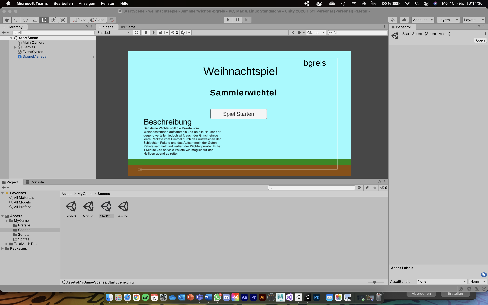
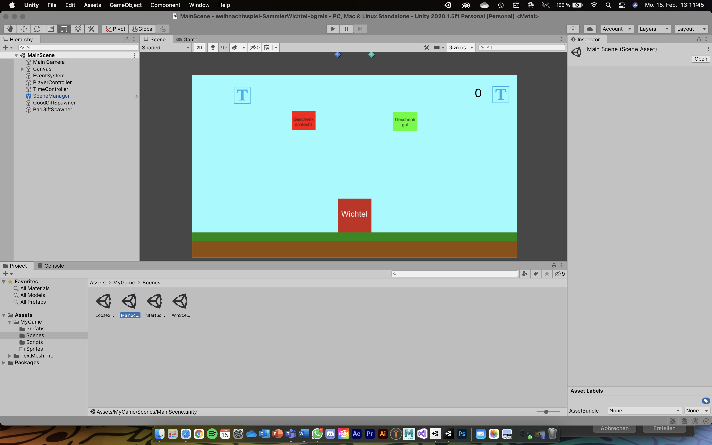
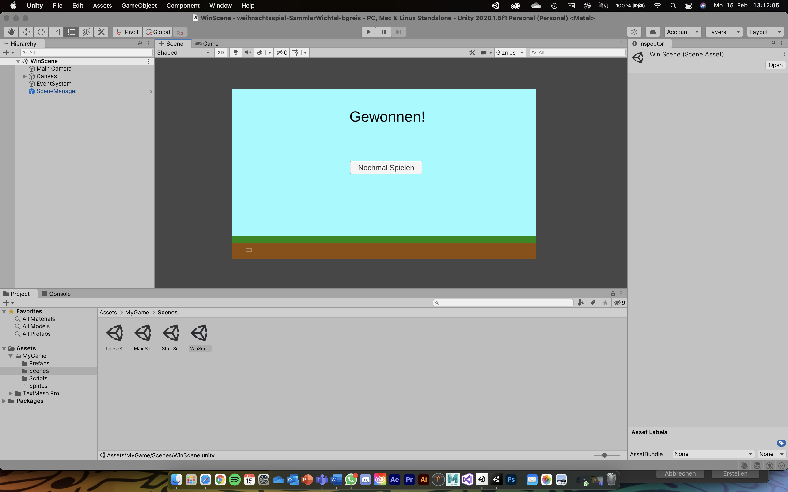
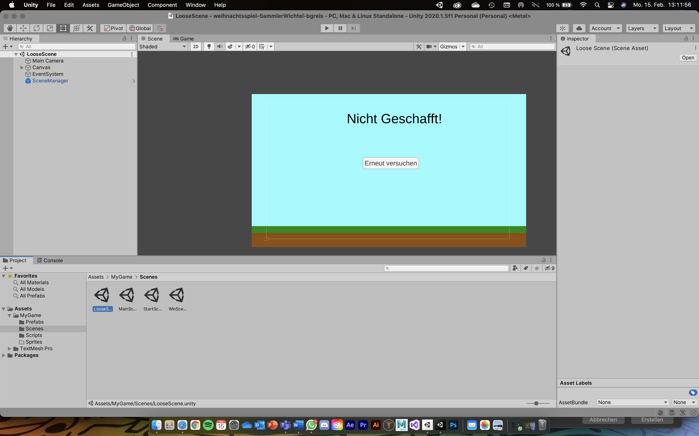

# SammlerWichtel

### Project description: 
The little elf should pick up the packages from Santa Claus and distribute them to all houses in the Neighbourhood. 
The Grinch throws some empty packages from the sky too. By dodging the bad packages and picking up the good ones the elf gains and loses points. He has 1 minute to save as many packages as possible for the Holy
evening.

### Development platform: 
(OS, Unity 2020 1.5f1 , Visual Studio 2019)
   
### Target platform: 
WebGL, Ref, Res 960x 600, screen independent 

### Visuals: 

        
        
        
        

### Third party material: 
/

### Project state: 
50% 
everything exept Sprites & clean Scripts

### MVP
• Aufsetzen des 2D Projekts screen-independent (960x600)
• Player bewegungen horizontal
• Timer 1 Minute Ende des Spiels
• Gute und Schlechte Pakete fallen von Himmel
• Score Display

### Limitations: 
/

### Lessons Learned:
c# (Class, Funktions, Player Controll, Scene Controll, Time/Score Controll, Drop Controll)

Copyright by bgreis
